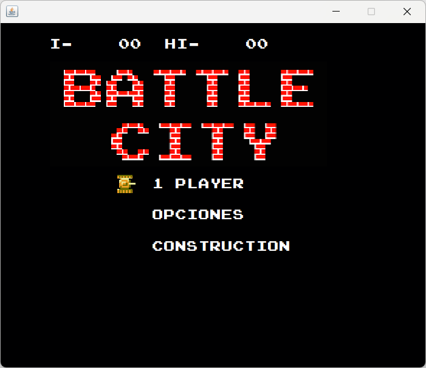
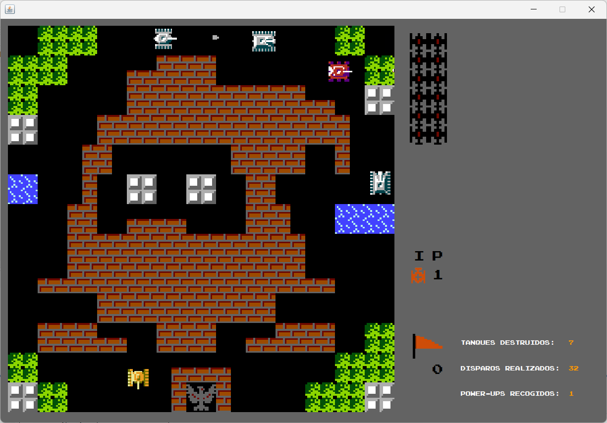
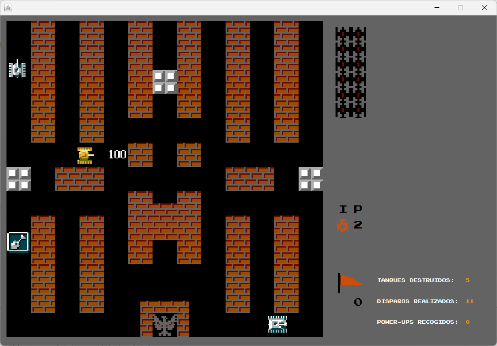
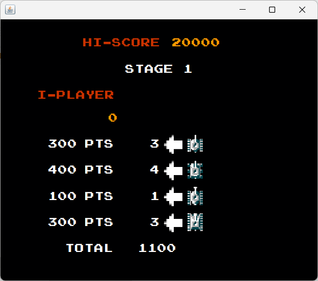
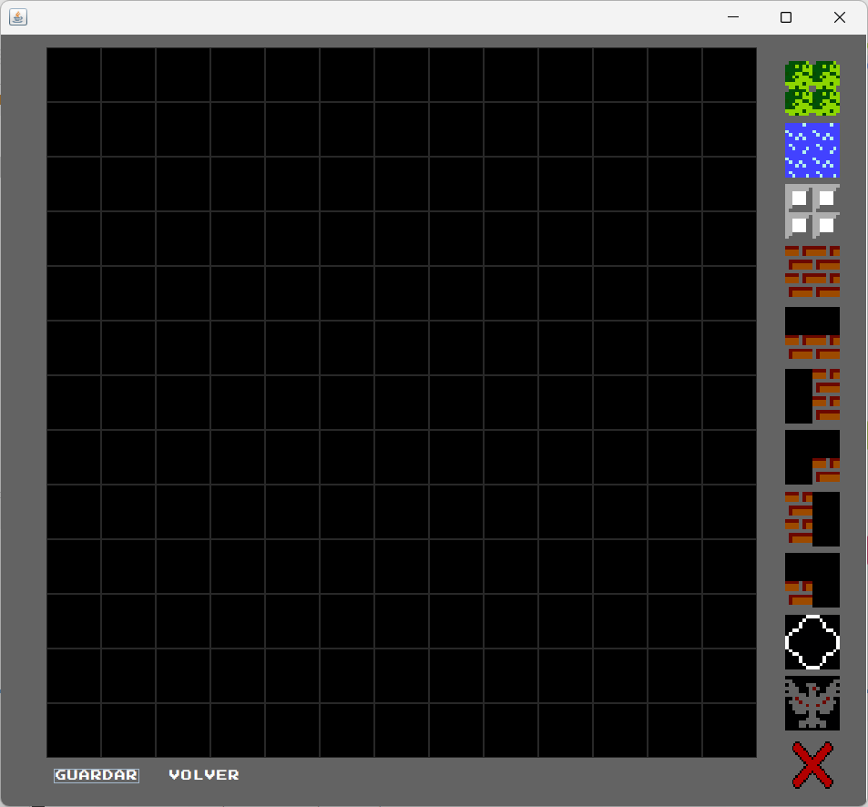
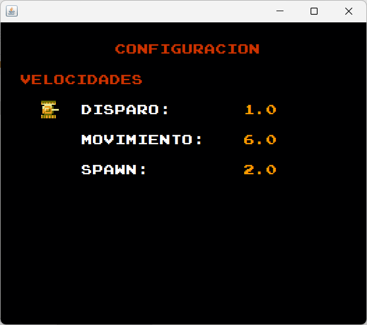

# BattleCity
Proyecto final para el curso de Programación Orientada a Objetos.

## Introducción
BattleCity es una adaptación del clásico juego de NES, lanzado originalmente en 1985. Este proyecto busca replicar y modernizar el concepto, añadiendo funcionalidades y aplicando patrones de diseño para una arquitectura de software sólida.

En el juego, controlas un tanque cuyo objetivo es defender la base militar de los ataques enemigos mientras destruyes a todos los tanques rivales. Si los enemigos destruyen la base o pierdes todas tus vidas, el juego termina. 

Pantalla principal del juego  
  

Gameplay   
  
  

Resumen al final del nivel  
  

## Creación de Niveles
El proyecto incluye un editor para diseñar niveles personalizados, ofreciendo libertad para elegir entre ocho mapas predefinidos o crear escenarios completamente nuevos. Estos niveles pueden ser jugados al editar el archivo main para seleccionarlos.

## Patrones de Diseño Implementados
1. **Command:** Maneja los comandos de movimiento, disparo y pausa.
2. **Observer:** Actualiza las estadísticas de disparos, comodines y tanques destruidos en tiempo real.
3. **Prototype:** Utilizado para crear enemigos y el tanque del jugador.
4. **Factory Method:** Gestiona la creación de escenarios.
5. **Strategy/Decorator:** Aplica bonificaciones al tanque del jugador.
6. **Singleton:** Controla la configuración del juego, como velocidades y tiempos de aparición.
7. **Memento:** Implementa la función de deshacer, permitiendo regresar al estado del juego 30 segundos antes.

## Configuración
El juego utiliza un archivo de configuración para ajustar:
- Velocidades de movimiento y disparo.
- Frecuencia de aparición de enemigos.  

